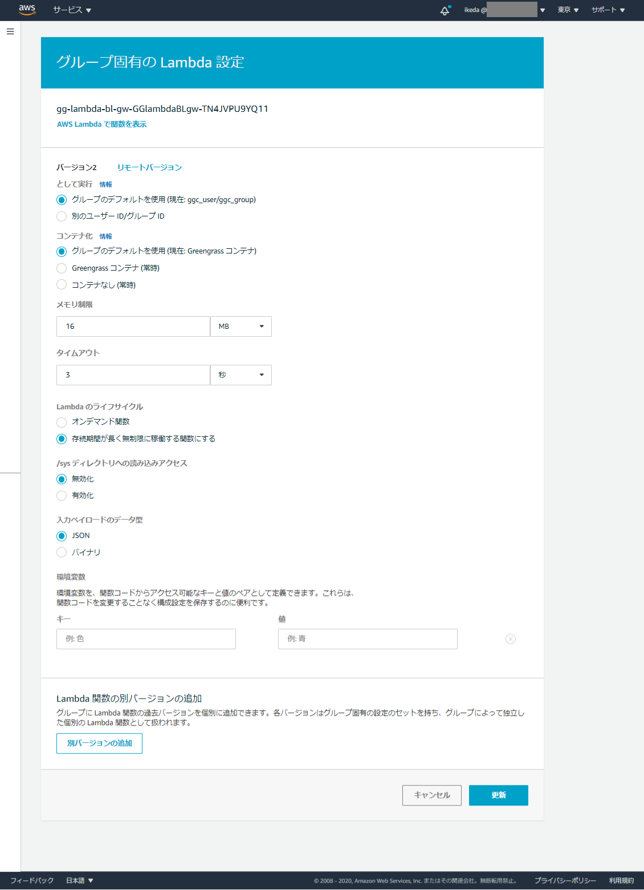

# GreengrassでつくるBluetoothゲートウェイ

## アーキテクチャ

Raspberry PIでGreengrassからデプロイされたLambdaがローカルのBLEアダプタにアクセスしてBLEデバイスの情報を取得しAWS IoT Coreに連携する。

## Raspberry PI のセットアップ

AWS CLIをインストールして自分のAWS環境にアクセスできるようにしておく。  
Greengrass coreのセットアップはAWSドキュメントのクイックスタートの手順そのまま実行する。
https://docs.aws.amazon.com/ja_jp/greengrass/latest/developerguide/quick-start.html

## プログラムコードの構成

### gg-lambda-bl-gw.py

Greengrass coreで実行されるLambdaプログラム。SAM CLIでデプロイをおこなう。  
Greengrassグループの設定で既存Lambdaを指定しておくことで以降はデプロイ時にバージョンをすすめていくことでRaspberry PI上で動くLambdaプログラムの開発・デプロイをおこなうことができる。

